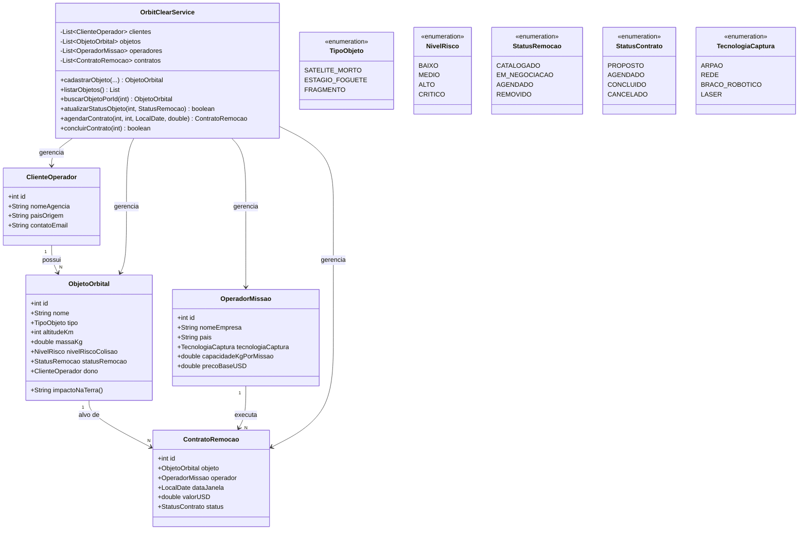
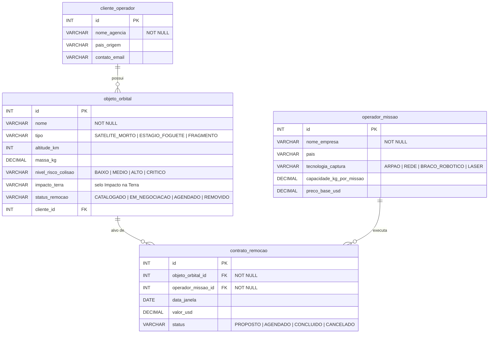

# OrbitClear

> Marketplace de remoção de lixo espacial — o "Uber" pra limpar a órbita da Terra.
> Global Solution 2026/1 · FIAP Engenharia de Software · Grupo 89

## O problema

A órbita baixa da Terra está entulhada de lixo: satélites mortos, estágios de foguete e milhões de fragmentos viajando a 28.000 km/h. Uma única colisão gera milhares de novos detritos — o efeito cascata conhecido como **síndrome de Kessler** — ameaçando a infraestrutura espacial da qual a Terra inteira depende: **GPS, previsão do tempo, comunicações, TV e monitoramento agrícola por satélite**. Hoje não existe uma forma organizada de contratar a remoção desses objetos.

## A solução

OrbitClear é um **marketplace** que conecta:

- **Agências e empresas** donas de objetos em órbita (quem precisa remover);
- **operadores de missão** especializados em captura de detritos (quem executa);

fechando **contratos de remoção** com data, preço e status — como pedir uma corrida, só que pra limpar o espaço.

## Por que importa pra Terra

Limpar a órbita não é "problema do espaço" — é manter funcionando o que a Terra usa todos os dias. Cada objeto cadastrado exibe um selo de **Impacto na Terra** (ex.: risco alto = ameaça rotas de GPS e satélites de meteorologia).

## Tecnologias

- **Java** (POO, aplicação de console) — lógica do sistema
- **SQL** (`CREATE TABLE`) + **diagrama ER** — modelagem de dados
- **HTML + CSS + JavaScript** (protótipo web — em breve neste repositório)

> Projeto acadêmico: tudo é **simulado**, sem integração entre as partes e sem backend real.

## Estrutura

```
orbitclear/
├── java/             # aplicação Java POO (console)
├── banco/            # script .sql do banco de dados
├── diagramas/        # diagrama de classes (UML) e ER, em Mermaid
├── web/              # protótipo HTML/CSS/JS (4 telas)
└── INTEGRANTES.txt   # equipe + link do vídeo pitch
```

## Como rodar (Java)

```bash
cd java
javac *.java
java Main
```

A aplicação sobe um menu no console com cadastro, listagem, busca e atualização de objetos, operadores, clientes e contratos de remoção.

## Banco de dados

```bash
# em qualquer SGBD compatível com SQL ANSI
sqlite3 orbitclear.db ".read banco/orbitclear.sql"
```

O script cria 4 tabelas relacionadas (`cliente_operador`, `operador_missao`, `objeto_orbital`, `contrato_remocao`) e já popula dados de exemplo com detritos e empresas reais (Envisat, Ariane-5, Cosmos-2251, ClearSpace, Astroscale).

## Diagramas

> Renderizam automaticamente aqui no GitHub. Fontes em `diagramas/*.mmd`.

### Diagrama de Classes (UML)



### Diagrama Entidade-Relacionamento (ER)

4 tabelas, 3 relacionamentos. `contrato_remocao` é a tabela associativa (N:N) entre objeto e operador.



## Equipe — Grupo 89

| Nome | RM |
|------|-----|
| Luiz Felipe Rodrigues Machado | RM32738 |
| Vitor Gomes | RM561317 |
| Pedro Sato | RM564859 |
| Felipe Wunder | RM561366 |
